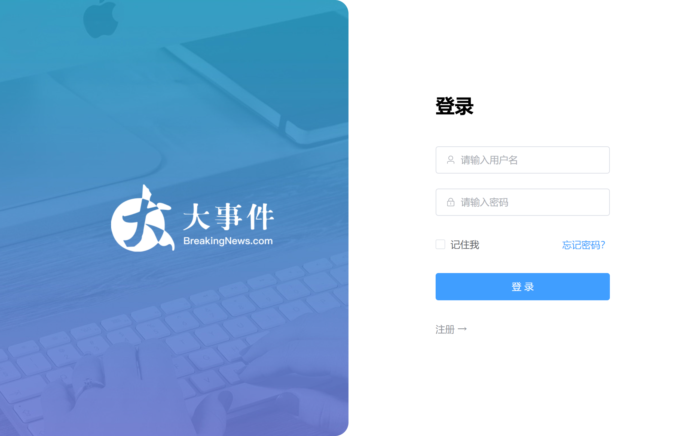
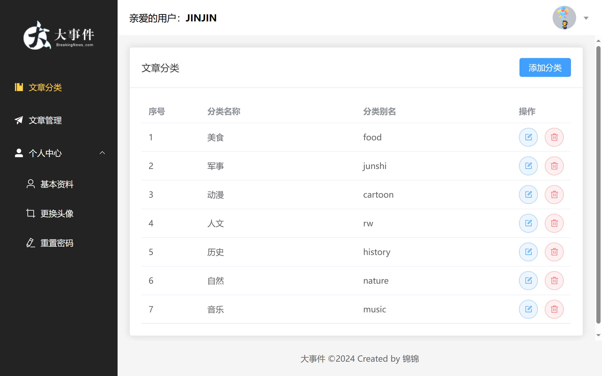
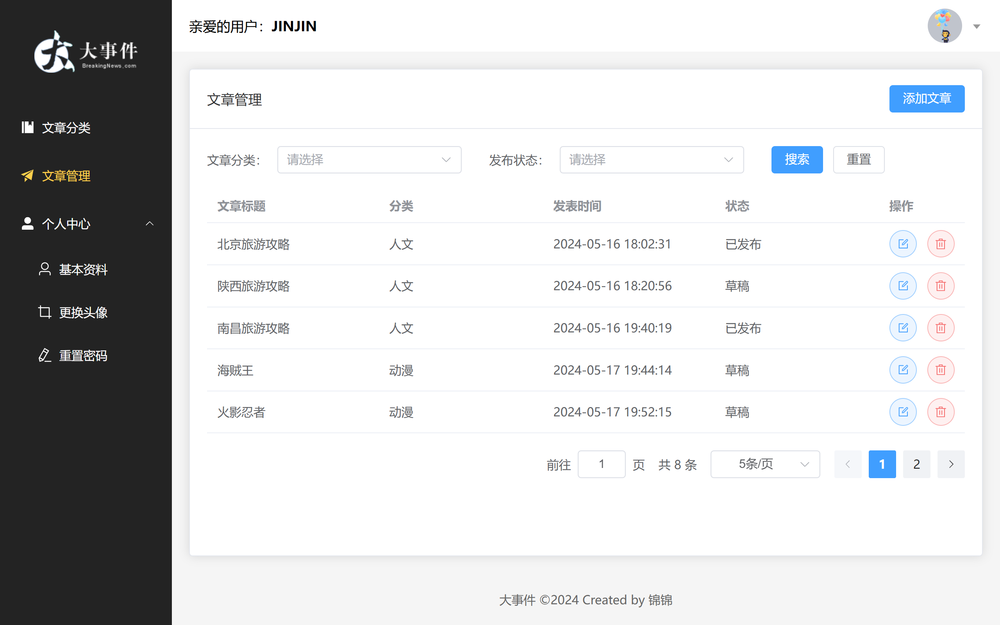
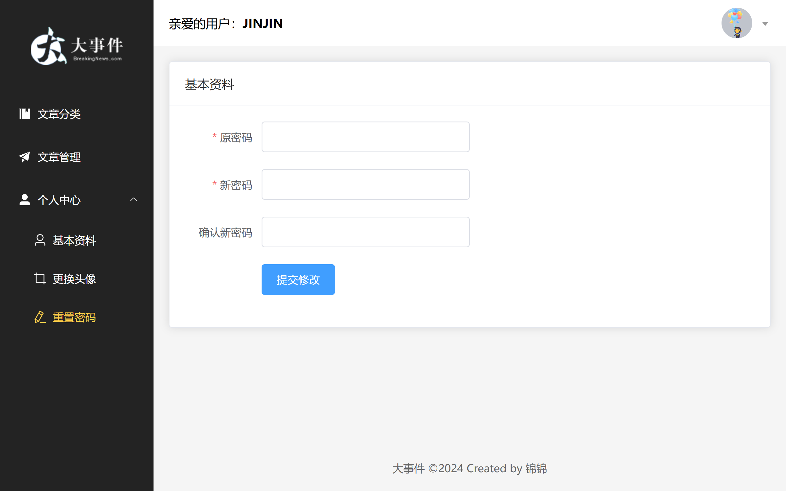

# big-event项目前端代码

使用了Vue3框架和Elem-Plus组件库进行快速开发。

需要的运行环境：

- NodeJS

## 运行项目的相关命令

安装项目依赖

```sh
npm install
```

开发时对项目进行编译和热更新

```sh
npm run dev
```

生产环境的编译

```sh
npm run build
```

## 大致功能

登录界面实现了用户登录和注册账户的功能页面：




文章分类界面，实现了文章分类列表的展示、新增、更新和删除功能：




文章管理界面，实现了文章的分页展示、新增、编辑和删除功能：




个人中心，分为了三个界面，实现用户的基本资料修改、更换头像和重置密码功能：

